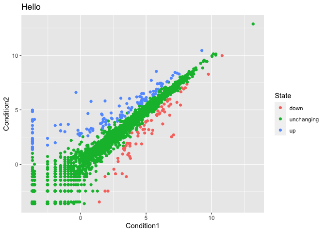

# Class05: Data Vis with ggplot
Barry (PID: 911)

# Graphics systems in R

There are many graphics systems in R for making plots and figures.

We have already played a little with **“base R”** graphics and the
`plot()` function.

Today we will start learning about a popular graphics package called
`ggplot2()`.

This is an add on package - i.e. we need to install it. I install it
(like I install any package) with the `install.packages()` function.

``` r
plot(cars)
```


Before I can use the functions from a package I have to load up the
package from my “library”. We use the `library(ggplot2)` command to load
it up.

``` r
library(ggplot2)
ggplot(cars)
```


Every ggplot is made up of at least 3 things: - data (the numbers etc.
that will go into your plot) - aes (how the columns of data map to the
plot aesthetics) - geoms (how the plot actually looks, points, bars,
lines etc.)

``` r
ggplot(cars) +
  aes(x=speed, y=dist) +
  geom_point()
```


For simple plots ggplot is more verbose - it takes more code - than base
R plot.

Add some more layers to our ggplot:

``` r
ggplot(cars) +
  aes(x=speed, y=dist) +
  geom_point() +
  geom_smooth(method="lm", se=FALSE) +
  labs(title="Stopping distance of old cars",
       subtitle = "A silly example plot") +
  theme_bw()
```

    `geom_smooth()` using formula = 'y ~ x'


## Section 6 of Lab Sheet

Ggplot makes it very easy to map additional variables to different
plotting aesthetics like size, transparency alpha and color.

The code below reads the results of a differential expression analysis
where a new anti-viral drug is being tested.

``` r
url <- "https://bioboot.github.io/bimm143_S20/class-material/up_down_expression.txt"
genes <- read.delim(url)
head(genes)
```

            Gene Condition1 Condition2      State
    1      A4GNT -3.6808610 -3.4401355 unchanging
    2       AAAS  4.5479580  4.3864126 unchanging
    3      AASDH  3.7190695  3.4787276 unchanging
    4       AATF  5.0784720  5.0151916 unchanging
    5       AATK  0.4711421  0.5598642 unchanging
    6 AB015752.4 -3.6808610 -3.5921390 unchanging

Q. Use the nrow() function to find out how many genes are in this
dataset. What is your answer?

``` r
nrow(genes)
```

    [1] 5196

Q. Use the colnames() function and the ncol() function on the genes data
frame to find out what the column names are (we will need these later)
and how many columns there are. How many columns did you find?

``` r
ncol(genes)
```

    [1] 4

Q. Use the `table()` function on the State column of this data.frame to
find out how many ‘up’ regulated genes there are. What is your answer?

``` r
head(genes)
```

            Gene Condition1 Condition2      State
    1      A4GNT -3.6808610 -3.4401355 unchanging
    2       AAAS  4.5479580  4.3864126 unchanging
    3      AASDH  3.7190695  3.4787276 unchanging
    4       AATF  5.0784720  5.0151916 unchanging
    5       AATK  0.4711421  0.5598642 unchanging
    6 AB015752.4 -3.6808610 -3.5921390 unchanging

``` r
table(genes$State)
```


          down unchanging         up 
            72       4997        127 

Q. Using your values above and 2 significant figures. What fraction of
total genes is up-regulated in this dataset?

``` r
round( table(genes$State) / nrow(genes) * 100, 2 )
```


          down unchanging         up 
          1.39      96.17       2.44 

Q. Complete the code below to produce the following plot

``` r
p <- ggplot(genes) + 
    aes(x=Condition1, y=Condition2, col=State) +
    geom_point()

p 
```


``` r
p + labs(title="Hello")
```



``` r
p2 <- p + scale_colour_manual( values=c("blue","gray","red") )
p2
```


Combining plots with patchwork package

``` r
library(patchwork)

# Use patchwork to combine them here:
(p / p2)
```


